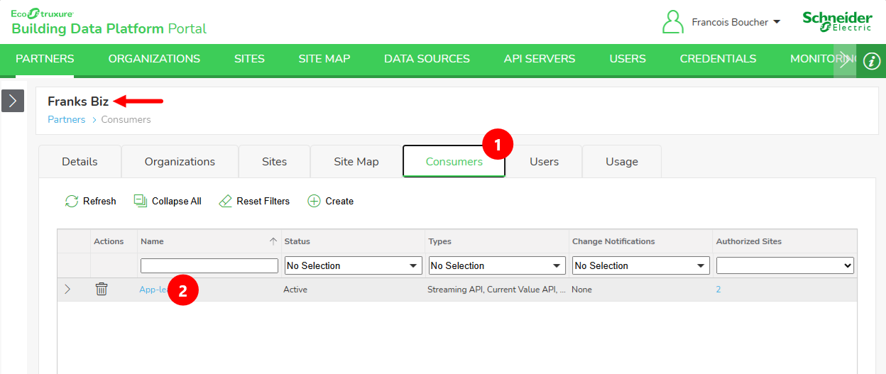
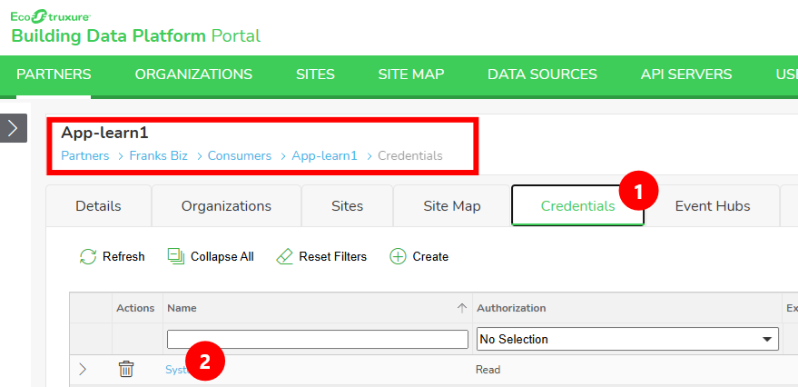
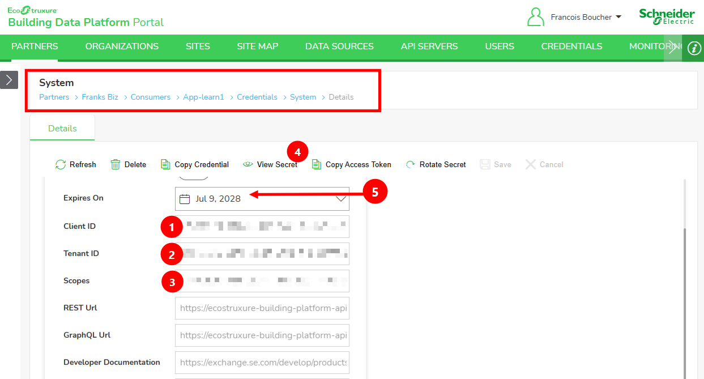

# Retrieve Client Credentials

## Goal

Collect the four values you need to request a BDP API access token yourself, instead of copying a short-lived token from the portal:

- **Tenant ID**
- **Client ID**
- **Client Secret**
- **Scopes**

With these values, your application can call the Microsoft identity platform token endpoint (OAuth 2.0 client credentials flow) and get a fresh access token whenever it needs one. See the [Retrieve Auth Token examples](../examples/README.md) for runnable code.

## Prerequisites

- **Portal access**: UAT - `https://ecostruxure-building-platform-uat.se.app/`
- **Correct role**: PartnerViewer/PartnerAdmin to view consumer credentials
- **An existing consumer and credential**: created for you during onboarding
- **Shell access**: PowerShell, Bash, or equivalent

## Steps

1. Open the Building Data Platform Portal (BDP Portal).

   Navigate to <https://ecostruxure-building-platform-uat.se.app/> and sign in.

2. Select your organization.

   From the **Partners** list, select your organization (for example, `Franks Biz`).

3. Open your consumer.

   Select the **Consumers** tab (1), then select your consumer in the list (2), for example `App-learn1`.

   

4. Open the credential you want to use.

   Select the **Credentials** tab (1), then select the credential you want to use (2), for example `System`.

   

5. Copy the credential details.

   The **Details** form of the credential shows everything you need:

   | # | Field | Environment variable used by the examples |
   | --- | --- | --- |
   | 1 | **Client ID** | `BDP_CLIENT_ID` |
   | 2 | **Tenant ID** | `BDP_TENANT_ID` |
   | 3 | **Scopes** | `BDP_SCOPES` |
   | 4 | **View Secret** (toolbar button), reveals the **Client Secret** | `BDP_CLIENT_SECRET` |
   | 5 | **Expires On**, the date after which the secret stops working | - |

   

6. Store the values as secrets.

   Treat all four values as secrets, and never commit them. Choose one method.

   - Method A: Set environment variables in your shell.

      ```powershell
      $env:BDP_TENANT_ID = "00000000-0000-0000-0000-000000000000"
      $env:BDP_CLIENT_ID = "00000000-0000-0000-0000-000000000000"
      $env:BDP_CLIENT_SECRET = "your-client-secret"
      $env:BDP_SCOPES = "api://.../.default"
      ```

      ```bash
      export BDP_TENANT_ID="00000000-0000-0000-0000-000000000000"
      export BDP_CLIENT_ID="00000000-0000-0000-0000-000000000000"
      export BDP_CLIENT_SECRET="your-client-secret"
      export BDP_SCOPES="api://.../.default"
      ```

   - Method B: Use a local `.env` file.

      Copy the example's `.env.template` to `.env` and fill the values. `.env` is excluded by `.gitignore`.

      ```dotenv
      BDP_TENANT_ID=00000000-0000-0000-0000-000000000000
      BDP_CLIENT_ID=00000000-0000-0000-0000-000000000000
      BDP_CLIENT_SECRET=your-client-secret
      BDP_SCOPES=api://.../.default
      ```

   - Method C: Use your API client's vault (Postman, Insomnia, Bruno, and similar). See [Setup Credentials for API Clients](setup-credentials-api-clients.md) and store each value as its own secret.

> [!TIP]
> Copy the **Scopes** value exactly as shown in the portal. A missing or modified scope is the most common cause of `invalid_scope` errors when requesting a token.

## Expected Outcome

- `BDP_TENANT_ID`, `BDP_CLIENT_ID`, `BDP_CLIENT_SECRET`, and `BDP_SCOPES` are available to your application, from environment variables, a local `.env` file, or a vault.
- You know when the client secret expires (**Expires On**).
- No credential value is hardcoded in scripts, command history snippets, or tracked files.

## Notes

### How the values are used

The values are sent to the Microsoft identity platform token endpoint:

```http
POST https://login.microsoftonline.com/{BDP_TENANT_ID}/oauth2/v2.0/token
Content-Type: application/x-www-form-urlencoded

client_id={BDP_CLIENT_ID}&scope={BDP_SCOPES}&client_secret={BDP_CLIENT_SECRET}&grant_type=client_credentials
```

The response contains an `access_token` that you send to the BDP API as a bearer token:

```http
GET https://ecostruxure-building-platform-api-uat.se.app/api/Sites
Authorization: Bearer {access_token}
X-Api-Version: 3.0
```

### Client secret vs. access token

- The **client secret** is long-lived (until **Expires On**). It must stay private: anyone who has it can request tokens for your consumer.
- The **access token** is short-lived. Request a new one when it expires, rather than storing it.

### Rotating the secret

Use **Rotate Secret** in the credential toolbar before the **Expires On** date, or immediately if the secret was exposed. Update your stored value right after rotating; the previous secret stops working.

## What's Next

- [Retrieve Auth Token (Python)](../examples/retrieve-auth-token-python/README.md)
- [Retrieve Auth Token (Node.js)](../examples/retrieve-auth-token-nodejs/README.md)
- [Retrieve Auth Token (.NET)](../examples/retrieve-auth-token-dotnet/README.md)
- [Retrieve Auth Token (Postman)](../examples/retrieve-auth-token-postman/README.md)
- [Setup Credentials](setup-credentials.md)
- [Troubleshooting](troubleshooting.md)
