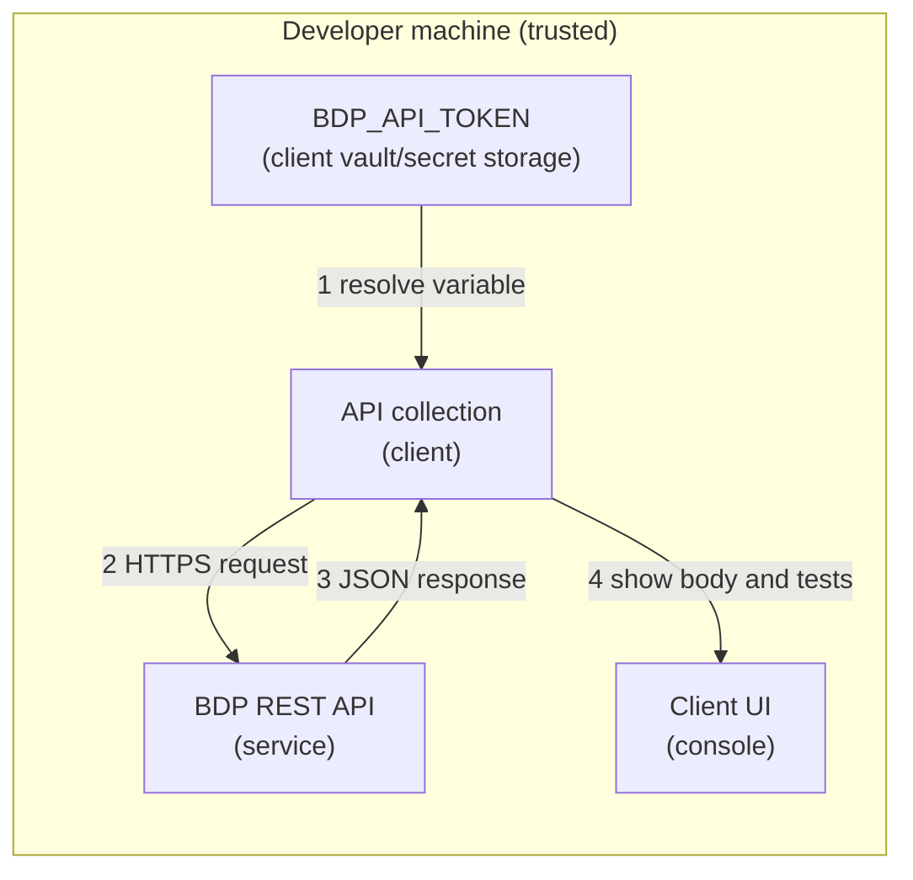

# Security: REST Quickstart (Postman)

This scenario ships an API collection (Postman Collection Format v2.1) that makes
authenticated HTTPS `GET` requests to the REST API. It handles one bearer token, held
by whichever compatible client you use.

## Credential Management

Credential used:

- `BDP_API_TOKEN`

The token is a collection variable with an empty committed value. It must be set
through your client's vault/secret storage, never by editing the committed collection
file. See [Setup Credentials for API Clients](../../docs/setup-credentials-api-clients.md)
for the exact steps, two rules apply regardless of client:

- Store the token in secret/vault storage, or a variable's **current value** column
  only. Never in the shared/initial value.
- Never export or commit a copy of the collection or environment with a real token
  value filled in.

For CI, pass the token at run time instead of storing it:
`newman run ... --env-var "BDP_API_TOKEN=$BDP_API_TOKEN"`.

For how access configuration affects what valid credentials can see, read
[Access Model and Permissions](../../docs/access-model-and-permissions.md).

## Network Security

Outbound HTTPS only:

- UAT: `https://ecostruxure-building-platform-api-uat.se.app`
- Production: `https://ecostruxure-building-platform-api.se.app`

Keep your client's certificate verification setting enabled; the collection never asks
for it to be disabled.

## Input Validation

The collection contains three read-only `GET` requests against fixed paths. Only
`baseUrl`, `apiVersion`, paging values, and `siteId` are variable, so a mistyped
variable cannot redirect a call to an unintended operation on the host.

A collection pre-request script fails the call early with an explicit message when
`BDP_API_TOKEN` is empty, instead of producing an unexplained `401`.

## Logging Practices

Test scripts print status hints only. The token is referenced as `{{BDP_API_TOKEN}}`
and never written to the console or to a response body.

Most clients store request and response history locally; clear it if a response
contained sensitive data.

## Threat Model

### Data Flow Diagram

Trust boundaries are crossed only once, at the HTTPS API call.

### STRIDE Analysis

Table - STRIDE

| Category | Threat | Mitigation | Status |
| --- | --- | --- | --- |
| **Spoofing** | Token stolen and reused | Token kept in current value only, rotate when exposed | Mitigated (process) |
| **Tampering** | Request changed in transit | HTTPS/TLS with certificate verification enabled | Mitigated |
| **Repudiation** | Request source disputes | Platform-side logging and local client history | Accepted |
| **Information Disclosure** | Token exported or synced with the collection | Empty committed value, vault/secret storage, no token in collection file | Mitigated |
| **Denial of Service** | Endpoint unavailable or slow | Client request timeout setting, manual retry | Accepted |
| **Elevation of Privilege** | Calling unintended endpoints | Fixed request paths, only host and filters are variable | Mitigated |

## Compliance

See [SECURITY.md](../../SECURITY.md) at the repository root for vulnerability reporting.
