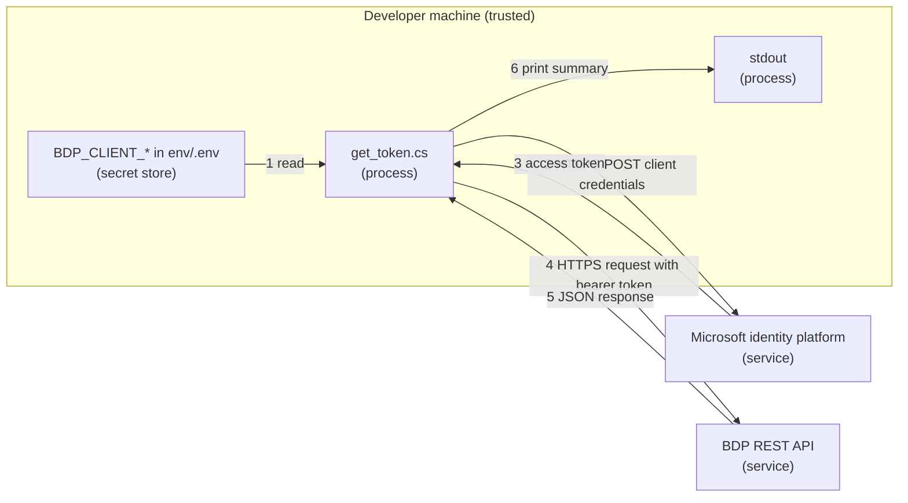

# Security: Retrieve Auth Token (.NET)

`get_token.cs` requests an access token from the Microsoft identity platform with the
OAuth 2.0 client credentials flow, then makes one authenticated HTTPS request to the
REST API to verify it. It handles one client secret and one short-lived access token.

## Credential Management

Credentials used:

- `BDP_TENANT_ID`
- `BDP_CLIENT_ID`
- `BDP_CLIENT_SECRET` (secret, long-lived until the portal **Expires On** date)
- `BDP_SCOPES`

The script reads these values from the process environment first, then from a local
`.env` file when present. `.env` is excluded by `.gitignore`; keep it local.

The script does not accept credentials as command-line arguments, so secrets do not
land in shell history or process lists. The client secret is sent only in the body of
the HTTPS `POST` to the token endpoint, never in a URL.

The access token is held in memory only. It is written to stdout only when you pass
`--print-token`; treat that output as a secret and do not redirect it to a tracked
file.

Rotate the client secret from the portal (**Rotate Secret**) before it expires, or
immediately if it was exposed. See
[Retrieve Client Credentials](../../docs/retrieve-client-credentials.md).

For how access configuration affects what valid credentials can see, read
[Access Model and Permissions](../../docs/access-model-and-permissions.md).

## Network Security

Outbound HTTPS only:

- Token endpoint: `https://login.microsoftonline.com`
- UAT: `https://ecostruxure-building-platform-api-uat.se.app`
- Production: `https://ecostruxure-building-platform-api.se.app`

TLS certificate validation is left at the .NET runtime default and is never disabled.

## Input Validation

The four required values are checked before any request is sent, and missing values
are reported by name only. The tenant ID is URL-encoded into the token URL, and all
form fields are URL-encoded in the request body.

Token endpoint failures are mapped from the `error` code to actionable hints. Only the
first line of `error_description` is printed, which never contains the secret.

## Logging Practices

The script prints the token URL, token type, lifetime, a masked preview of the access
token, and the verification call summary. It never prints the client secret, and
prints the full access token only with `--print-token`.

## Threat Model

### Data Flow Diagram

Trust boundaries are crossed twice, at the token request and at the API call, both
over HTTPS.

### STRIDE Analysis

Table - STRIDE

| Category | Threat | Mitigation | Status |
| --- | --- | --- | --- |
| **Spoofing** | Client secret stolen and used to mint tokens | Keep secret in env/.env only, rotate from the portal when exposed | Mitigated (process) |
| **Tampering** | Request changed in transit | HTTPS/TLS with default certificate validation | Mitigated |
| **Repudiation** | Request source disputes | Identity platform sign-in logs and platform-side logging | Accepted |
| **Information Disclosure** | Secret or token printed accidentally | Secret never printed; token masked unless `--print-token` | Mitigated |
| **Denial of Service** | Endpoint unavailable or slow | Explicit timeout and controlled failure path | Accepted |
| **Elevation of Privilege** | Token requested for an unintended scope | Scope comes from the portal value only; API enforces consumer authorization | Mitigated |

## Compliance

See [SECURITY.md](../../SECURITY.md) at the repository root for vulnerability reporting.
