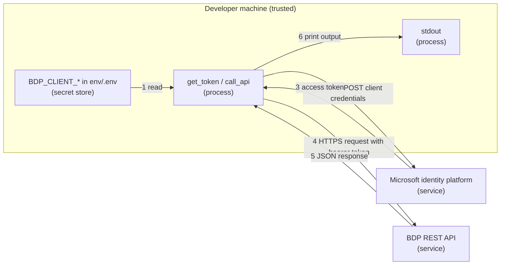

# Security: Retrieve Auth Token (.NET)

`get_token.cs` requests an access token from the Microsoft identity platform with the OAuth 2.0 client credentials flow and prints it. `call_api.cs` requests a token the same way, keeps it in memory while it is valid, and uses it for HTTPS calls to the REST API. Both handle one client secret and one short-lived access token.

## Credential Management

Credentials used:

- `BDP_TENANT_ID`
- `BDP_CLIENT_ID`
- `BDP_CLIENT_SECRET` (secret, long-lived until the portal **Expires On** date)
- `BDP_SCOPES`

The scripts read these values from the process environment, and from a local `.env` file when present. `.env` is excluded by `.gitignore`; keep it local.

The scripts do not accept credentials as command-line arguments, so secrets do not land in shell history or process lists. The client secret is sent only in the body of the HTTPS `POST` to the token endpoint, never in a URL.

`get_token.cs` prints the access token on purpose, to show what it looks like. Treat that output as a secret: do not paste it in tickets or chats, and do not redirect it to a tracked file. `call_api.cs` never prints the token; it keeps it in memory only.

Rotate the client secret from the portal (**Rotate Secret**) before it expires, or immediately if it was exposed. See [Retrieve Client Credentials](../../docs/retrieve-client-credentials.md).

For how access configuration affects what valid credentials can see, read [Access Model and Permissions](../../docs/access-model-and-permissions.md).

## Network Security

Outbound HTTPS only:

- Token endpoint: `https://login.microsoftonline.com`
- UAT: `https://ecostruxure-building-platform-api-uat.se.app`
- Production: `https://ecostruxure-building-platform-api.se.app`

TLS certificate validation is left at the .NET runtime default and is never disabled.

## Input Validation

The scripts are intentionally minimal teaching code. Hosts and paths are fixed literals; only the four credential values are read from the environment. Any non-success HTTP status stops the script with an error that includes the status, and never the client secret.

## Logging Practices

`get_token.cs` prints the access token only. `call_api.cs` prints `requesting a new token` when it refreshes, and the API response bodies. Neither script prints the client secret.

## Threat Model

### Data Flow Diagram

Trust boundaries are crossed twice, at the token request and at the API call, both over HTTPS.

### STRIDE Analysis

Table - STRIDE

| Category | Threat | Mitigation | Status |
| --- | --- | --- | --- |
| **Spoofing** | Client secret stolen and used to mint tokens | Keep secret in env/.env only, rotate from the portal when exposed | Mitigated (process) |
| **Tampering** | Request changed in transit | HTTPS/TLS with default certificate validation | Mitigated |
| **Repudiation** | Request source disputes | Identity platform sign-in logs and platform-side logging | Accepted |
| **Information Disclosure** | Token printed by `get_token.cs` is shared | Printed on purpose for learning; short-lived; `call_api.cs` never prints it | Accepted |
| **Denial of Service** | Endpoint unavailable or slow | Script stops on failure; token reused to limit token requests | Accepted |
| **Elevation of Privilege** | Token requested for an unintended scope | Scope comes from the portal value only; API enforces consumer authorization | Mitigated |

## Compliance

See [SECURITY.md](../../SECURITY.md) at the repository root for vulnerability reporting.
