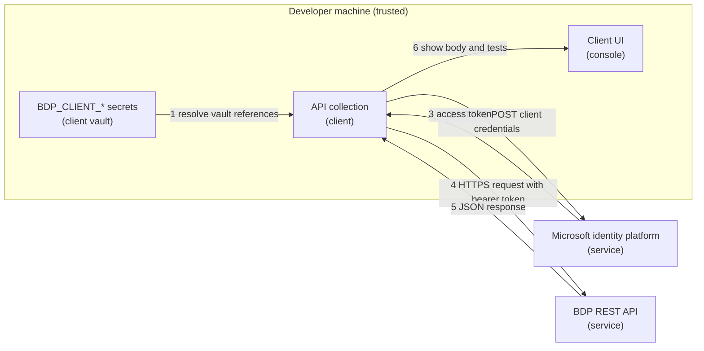

# Security: Retrieve Auth Token (Postman)

This scenario ships an API collection (Postman Collection Format v2.1) that requests an access token from the Microsoft identity platform with the OAuth 2.0 client credentials flow, then makes one authenticated HTTPS `GET` request to the REST API. It handles one client secret and one short-lived access token, held by whichever compatible client you use.

## Credential Management

Credentials used:

- `BDP_TENANT_ID`
- `BDP_CLIENT_ID`
- `BDP_CLIENT_SECRET` (secret, long-lived until the portal **Expires On** date)
- `BDP_SCOPES`

Each value is stored as a vault secret, never as a plain collection variable. Requests reference them directly as `{{vault:NAME}}`. See [Setup Credentials for API Clients](../../docs/setup-credentials-api-clients.md) for the exact steps, two rules apply regardless of client:

- Store the values in secret/vault storage only, never as a plain collection or environment variable value.
- Never export or commit a copy of the collection with a real value filled in.

The client secret is sent only in the form body of the HTTPS `POST` to the token endpoint, never in a URL.

The access token is written by the test script to the `accessToken` collection variable as a current value, so it can be reused by `List Sites`. Clear it (or reset the collection variables) before exporting or sharing the collection. It expires on its own after about one hour.

Postman Vault is a Postman-app-local feature; `{{vault:...}}` does not resolve under Newman or other CI runners. For CI, use a copy of the collection with plain variables and pass the values at run time with `--env-var`.

Rotate the client secret from the portal (**Rotate Secret**) before it expires, or immediately if it was exposed. See [Retrieve Client Credentials](../../docs/retrieve-client-credentials.md).

For how access configuration affects what valid credentials can see, read [Access Model and Permissions](../../docs/access-model-and-permissions.md).

## Network Security

Outbound HTTPS only:

- Token endpoint: `https://login.microsoftonline.com`
- UAT: `https://ecostruxure-building-platform-api-uat.se.app`
- Production: `https://ecostruxure-building-platform-api.se.app`

Keep your client's certificate verification setting enabled; the collection never asks for it to be disabled.

## Input Validation

The collection contains one `POST` to the token endpoint and one read-only `GET`, against fixed, literal hosts. Only the vault values, `apiVersion`, and `take` are variable, so a mistyped variable cannot redirect a call to an unintended host.

A missing or empty vault secret produces an `invalid_request` error from the token endpoint rather than a token for an unintended application.

## Logging Practices

Test scripts print status hints and the token lifetime only. They never write the client secret or the access token to the console.

Most clients store request and response history locally, and the `Get Access Token` response body contains the access token. Clear the history if you share your workspace or machine.

## Threat Model

### Data Flow Diagram

Trust boundaries are crossed twice, at the token request and at the API call, both over HTTPS.

### STRIDE Analysis

Table - STRIDE

| Category | Threat | Mitigation | Status |
| --- | --- | --- | --- |
| **Spoofing** | Client secret stolen and used to mint tokens | Secret kept in vault storage only, rotate from the portal when exposed | Mitigated (process) |
| **Tampering** | Request changed in transit | HTTPS/TLS with certificate verification enabled | Mitigated |
| **Repudiation** | Request source disputes | Identity platform sign-in logs and local client history | Accepted |
| **Information Disclosure** | Secret or token exported with the collection | Vault-only secrets; clear `accessToken` before export | Mitigated (process) |
| **Denial of Service** | Endpoint unavailable or slow | Client request timeout setting, manual retry | Accepted |
| **Elevation of Privilege** | Token requested for an unintended scope | Scope comes from the portal value only; API enforces consumer authorization | Mitigated |

## Compliance

See [SECURITY.md](../../SECURITY.md) at the repository root for vulnerability reporting.
